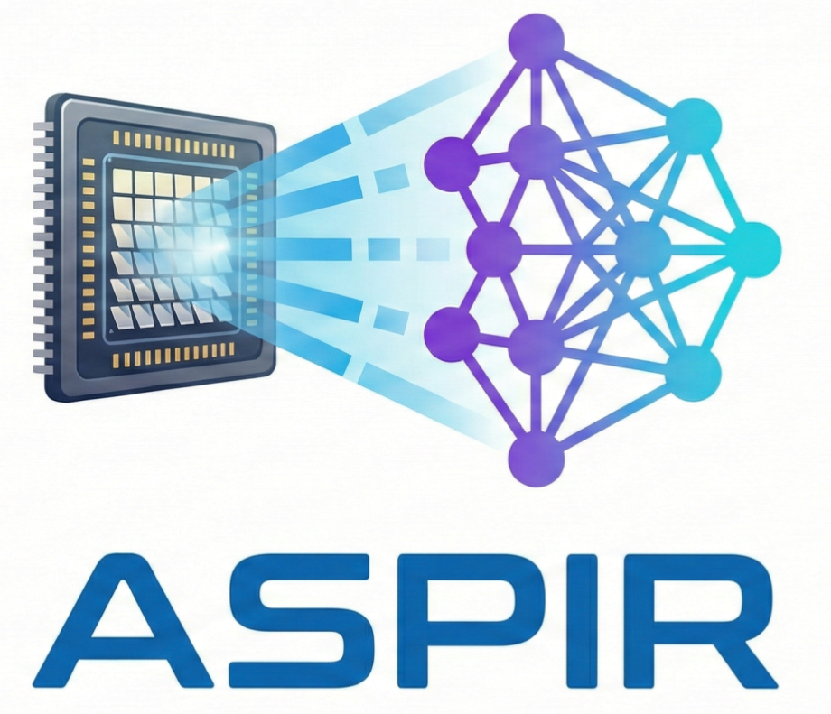

<p align="center">
  
</p>

<h1 align="center">ASPIR: A Single-Pixel Imaging Research Platform</h1>

<p align="center">
  PyQt5 application for <strong>Single Pixel Imaging (SPI)</strong> simulation and analysis.<br>
  Implements a complete computational imaging pipeline for infrared beam profiling using mask patterns, classical reconstruction algorithms, and neural network post-processing.
</p>

---

## Quick Start

### Option 1: Local Development

For development and debugging. Requires manual installation of optional tools (pdflatex, nsys, kaggle).

#### Linux

```bash
# 1. Clone and enter
git clone https://github.com/Xarlie123/aspir.git
cd aspir

# 2. Create virtual environment
python -m venv .venv
source .venv/bin/activate

# 3. Install dependencies
pip install -r requirements_linux.txt

# 4. Run (working directory MUST be src/)
cd src
python main.py
```

#### Windows

```powershell
# 1. Clone and enter
git clone https://github.com/Xarlie123/aspir.git
cd aspir

# 2. Create virtual environment
python -m venv .venv
.venv\Scripts\activate

# 3. Install dependencies
pip install -r requirements_windows.txt

# 4. Run (working directory MUST be src/)
cd src
python main.py
```

### Option 2: Docker (Recommended)

Pre-configured environment with all dependencies and tools included (pdflatex, NVIDIA Nsight Systems, Kaggle CLI). Code is mounted from host, so changes are reflected immediately without rebuilding.

**Prerequisites:**
- [Docker Desktop](https://www.docker.com/products/docker-desktop/) with WSL2 backend (Windows) or Docker Engine (Linux)
- NVIDIA GPU drivers and [NVIDIA Container Toolkit](https://docs.nvidia.com/datacenter/cloud-native/container-toolkit/install-guide.html)

```bash
# Build (only needed once, or after changing dependencies)
docker build -f docker/Dockerfile -t aspir .
```

**Linux:**
```bash
xhost +local:
docker run --rm -it \
  --gpus all \
  -e DISPLAY=$DISPLAY \
  -v /tmp/.X11-unix:/tmp/.X11-unix:rw \
  -v /sys/class/powercap:/sys/class/powercap:ro \
  -v "$(pwd)":/app \
  aspir
```

**Windows (PowerShell):**

1. Install [VcXsrv](https://sourceforge.net/projects/vcxsrv/) (free X server for Windows)

2. Launch VcXsrv (XLaunch) with these settings:
   - Display settings: **Multiple windows**, Display number: **0**
   - Client startup: **Start no client**
   - Extra settings: Check **Disable access control**, uncheck "Native opengl"

3. Run the container:
```powershell
$env:DISPLAY="host.docker.internal:0.0"
docker run --rm -it `
  --gpus all `
  -e DISPLAY=$env:DISPLAY `
  -v "${PWD}:/app" `
  aspir
```

> **Note (Linux only):** RAPL CPU energy profiling requires: `sudo chmod -R a+r /sys/class/powercap/intel-rapl/`

## Directory Structure

```
aspir/
├── src/                          # Source code (working directory)
│   ├── main.py                   # Application entry point
│   ├── simulation_engine/        # Core simulation pipeline
│   │   ├── _1_dataset_gen/       # Dataset generators
│   │   ├── _2_mask_gen/          # Mask pattern generators
│   │   ├── _3_applicator/        # Reconstruction algorithms
│   │   ├── _4_postprocessor/     # Neural network models
│   │   ├── _5_analyzer/          # Metrics & profiling
│   │   └── _6_pipeline/          # Batch execution
│   └── ui/                       # PyQt5 GUI
│       ├── custom_widgets/       # Reusable UI components
│       ├── modes/                # Single Test, Batch Test, Batch Reports
│       └── utils/                # Config, logging, file handling
├── datasets/                     # Downloaded and generated datasets
├── settings/                     # Application settings (log config, etc.)
├── docker/                       # Docker configuration
├── requirements_windows.txt      # Python dependencies (Windows)
├── requirements_linux.txt        # Python dependencies (Linux)
└── requirements_docker.txt       # Python dependencies (Docker)
```

## Requirements

- Python 3.10+
- NVIDIA GPU + CUDA 12.4 (for GPU acceleration)
- PyQt5, PyTorch, NumPy, SciPy, pylops, pyproximal

## External Applications

These tools are **pre-installed in the Docker image**. For local development, install them manually and configure via **Settings → External Applications**:

- **pdflatex**: DNN architecture preview diagrams ([TeX Live](https://www.tug.org/texlive/) or [MiKTeX](https://miktex.org/))
- **nsys**: NVIDIA Nsight Systems profiling ([NVIDIA Developer](https://developer.nvidia.com/nsight-systems))
- **kaggle**: Dataset downloads from Kaggle (`pip install kaggle`)

## License

Research project 
