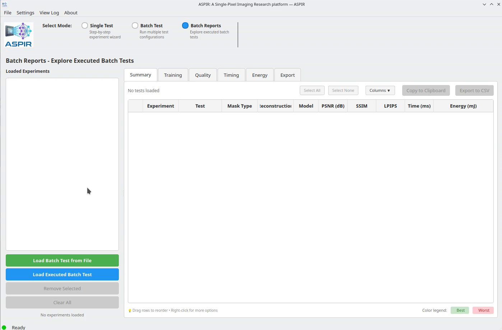

# Batch Reports

```{note}
Since training multiple experiments can be time-consuming, Batch Reports mode allows you to explore offline the results of previously executed batch experiments, loading and analyzing data without having to re-run them.
```

```{raw} html
<div style="max-width: 350px;">
```

```{mermaid}
flowchart LR
    A[Load Batch Results] --> B[Compare & Export]
```

```{raw} html
</div>
```

Load `.batch_analysis_report` files to review completed experiments. You can also load multiple report files to compare results across different batch experiments.

You can also load multiple report files to compare results across different batch experiments.

## Loading Experiments

1. Switch to **Batch Reports** mode
2. Click **Load Experiment** and select a `.batch_analysis_report` file
3. To compare across experiments, load additional report files

## Available Views

- **Summary**: Overview table with all tests and their metrics, color-coded for easy comparison.
- **Quality**: each chart in the *Chart Type* list on the left:
  - *Quality Metrics Comparison* — grouped bar chart (PSNR / SSIM / LPIPS) with values normalised against fixed references (PSNR /40 dB, SSIM raw, 1−LPIPS) so the worst-quality bar stays visible.
  - *PSNR vs Sampling Ratio* — line + markers chart showing reconstructed vs denoised PSNR against M/N (%); ±1σ shading uses per-image data when available. Designed as the headline figure for compressive-sensing ablation tables.
  - *Metrics per Image* and *Metrics Histogram* — per-image distributions.
  - *Quality Metrics Table* — sortable table with right-click **Export CSV** / **Export LaTeX**.
- **Timing**: two chart types under *Chart Type*:
  - *Pipeline Latency Breakdown* — stacked bars per test split into Mask projection + Reconstruction + Inference, with separate CPU and GPU columns when both are measured.
  - *Energy per Image vs Sampling Ratio* — line + markers chart of energy (mJ/image) vs M/N (%), one line per compute path (CPU run vs GPU run); auto-switches to log Y when CPU/GPU energies differ by more than 5×.

  Below the chart, the **Timing Summary** table shows acquisition / reconstruction / inference / total times for the selected test. Right-click the panel for **Copy table** (TSV pasteable into spreadsheets).
- **Energy**: charts with a *Compute path* selector on the left (`CPU run + GPU run`, `CPU run only`, `GPU run only`). Tests are paired by name and split by their `use_gpu` flag, so loading the two outputs of a "Run both compute paths" re-measurement (see below) populates both bars per test. Right-click the **Energy Summary** panel for **Copy table**.
- **Training**: loss curves and convergence analysis for each neural network model.

## Re-measure Timing & Energy on Different Hardware

Useful workflow: train a batch on a workstation (slow) and only measure latency / energy on a target device like a Jetson Orin NX (fast). Right-click an experiment in the list → **Re-measure timing & energy…** opens a dialog with:

- Toggles for what to re-measure (timing, energy, or both).
- Warmup and measurement-run counts; the energy phase is automatically split into 10 sub-blocks so you get a real `energy_std_mj` per test.
- A **Run both compute paths** checkbox that executes the entire job twice — once with `use_gpu=False` (CPU pass) and once with `use_gpu=True` (GPU pass) — with a 30 s thermal cooldown between passes. Each pass writes its own report file with a `-cpu` / `-gpu` tag and auto-loads next to the original.
- A "Device label" field tagged into the output filename so several re-measurements on different hosts stay distinguishable.

The action is enabled only for experiments exported with model checkpoints (export level *Reports + models* or higher); on Jetson the daemon must be running (`sudo systemctl enable --now jtop`) — see {doc}`../installation` for the one-time setup.

## Configuring Charts

Each chart toolbar has a settings button (gear icon) that opens **Configure chart settings** with:

- *Axes* — title / labels font size, X and Y label padding (useful when the chart has a secondary tick row), and a separate "Data labels" font size for the numeric values drawn on top of bars.
- *Colors* — per-metric colours for the comparison chart, plus a **Lines (PSNR vs M/N)** group with pickers for the Reconstructed and Denoised series (defaults to matplotlib's `tab:blue` + `tab:orange`).
- *Legend* — position (inside / right / below), font size, frame.

## Exporting Reports

Results can be exported to HTML, PDF, LaTeX, or CSV for use in publications or further analysis. The Quality and Energy summary panels also support right-click → **Copy table** for quick TSV paste into a spreadsheet.

```{only} html
<video width="80%" controls>
  <source src="../1_batch_reports_from_file.mp4" type="video/mp4">
</video>
```

```{only} latex


*Watch the full video in the [online documentation](https://aspir.readthedocs.io/en/latest/quickstart/batch_reports.html).*
```
