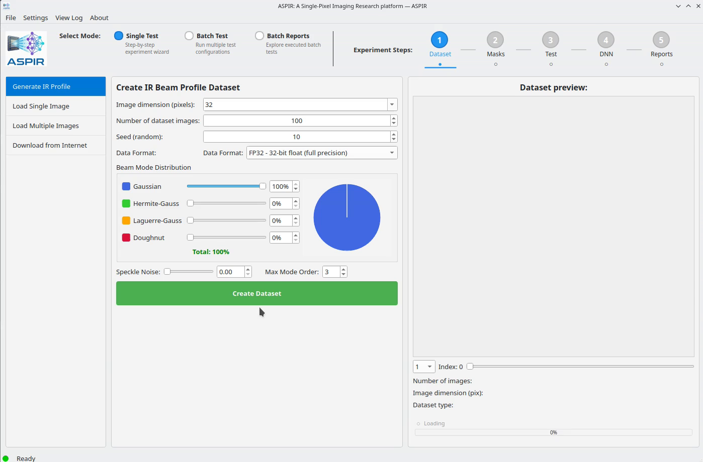

# Step 1: Configure and Run Tests

1. Switch to **Batch Test** mode
2. Click **Add Test** to create a new configuration
3. For each test, configure:
   - **Mask**: Type, number of patterns, seed
   - **Reconstruction**: Method (Ghost Imaging, Pseudoinverse, FISTA, TV-Norm)
   - **Model**: Architecture, epochs, batch size, learning rate
4. Repeat to add as many configurations as needed
5. Set an **Export Name** to identify your results
6. Click **Run Batch**

Tests run sequentially by default. Parallel execution is available for independent tests.

```{only} html
<video width="80%" controls>
  <source src="../1_batch_test.mp4" type="video/mp4">
</video>
```

```{only} latex


*Watch the full video in the [online documentation](https://aspir.readthedocs.io/en/latest/quickstart/batch_step1_configure.html).*
```
