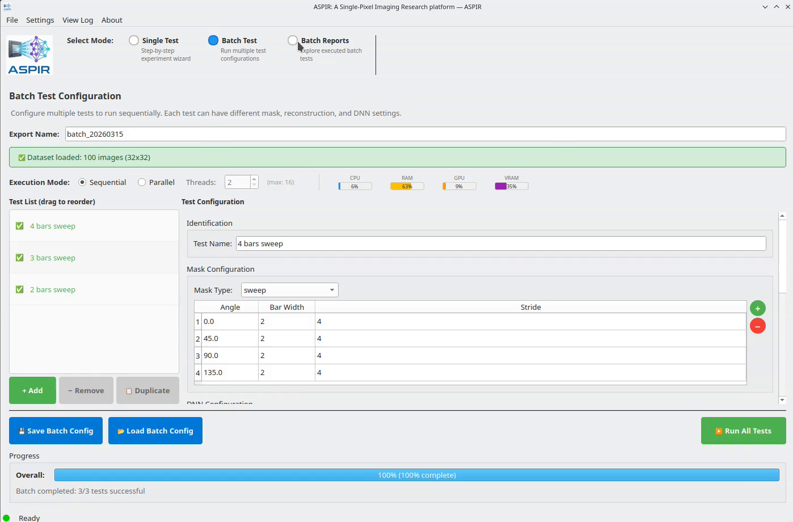

# Step 2: Explore Results

1. Switch to **Batch Reports** mode
2. Click **Load Experiment** and select your experiment folder
3. Browse the available views:
   - **Summary**: Table with all tests and their metrics
   - **Quality**: Bar charts comparing PSNR, SSIM, LPIPS across tests
   - **Timing**: Pipeline latency breakdown per stage
   - **Training**: Loss curves and convergence analysis
   - **Details**: Full configuration and per-test metrics

Results can be exported to HTML, PDF, LaTeX, or CSV.

```{only} html
<video width="80%" controls>
  <source src="../2_batch_reports.mp4" type="video/mp4">
</video>
```

```{only} latex


*Watch the full video in the [online documentation](https://aspir.readthedocs.io/en/latest/quickstart/batch_step3_results.html).*
```
