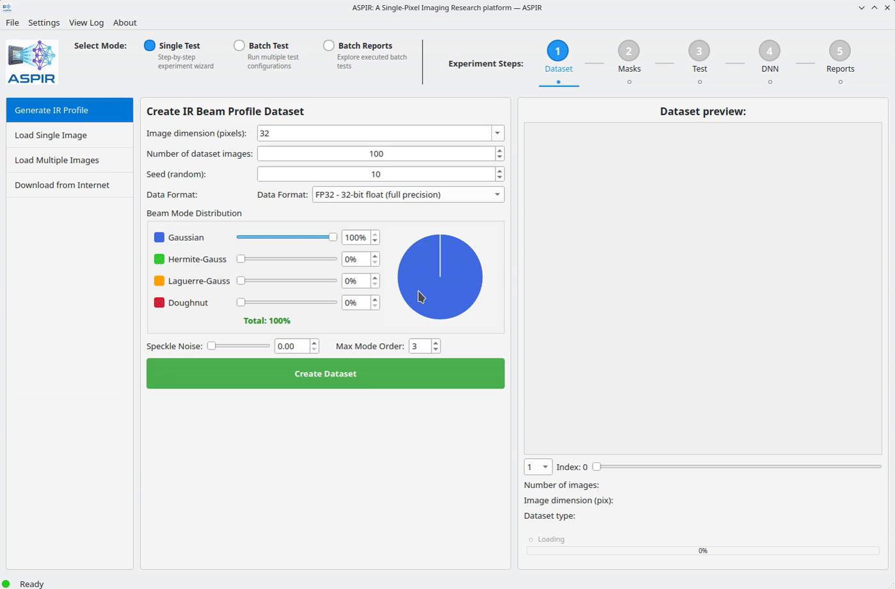

# Step 1: Load a Dataset

1. Launch ASPIR and ensure you're in **Single Test** mode
2. In the **Dataset** section, select **From Image**
3. Click **Browse** and select any grayscale image
4. Set the resolution (e.g., 64×64 for quick testing)
5. Click **Generate Dataset**

The preview panel shows your loaded images.

```{only} html
<video width="80%" controls>
  <source src="../1_dataset.mp4" type="video/mp4">
</video>
```

```{only} latex


*Watch the full video in the [online documentation](https://aspir.readthedocs.io/en/latest/quickstart/step1_dataset.html).*
```
