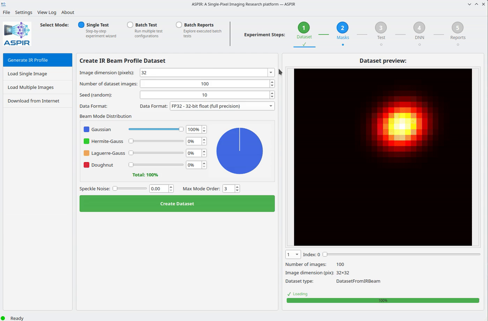

# Step 2: Generate Mask Patterns

1. Go to the **Masks** section
2. Select mask type: **Scatter** (random sampling) is a good start
3. Configure parameters:
   - **Number of patterns**: 512 (more = better quality, slower)
   - **Seed**: Any number (for reproducibility)
4. Click **Generate Masks**

The preview shows the generated mask patterns.

```{only} html
<video width="80%" controls>
  <source src="../2_masks.mp4" type="video/mp4">
</video>
```

```{only} latex


*Watch the full video in the [online documentation](https://aspir.readthedocs.io/en/latest/quickstart/step2_masks.html).*
```
