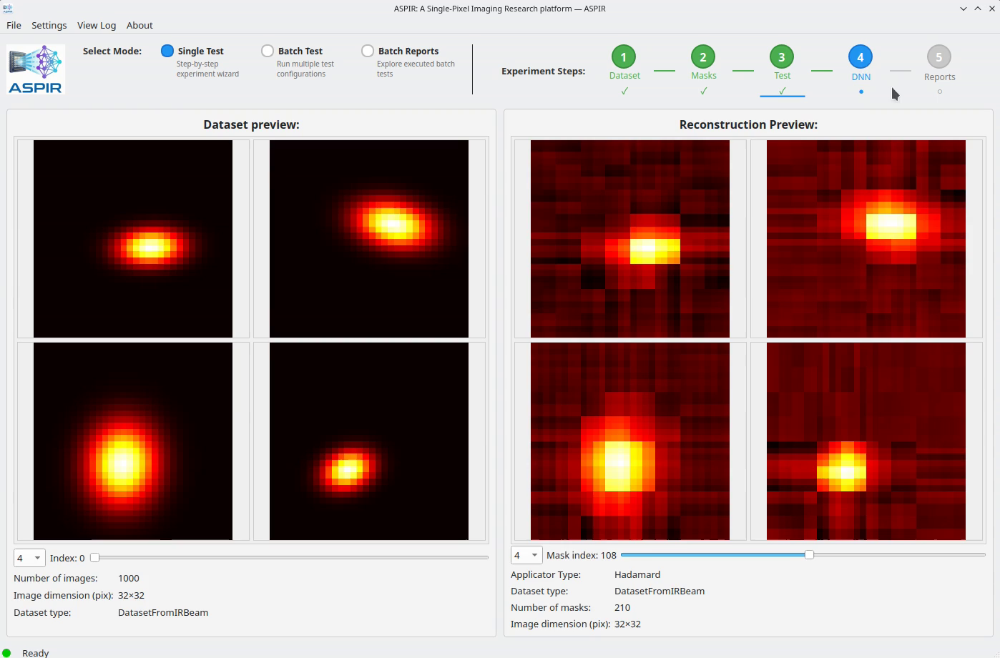

# Step 4: Train a Neural Network

1. Go to the **Post-processing** section
2. Select a model: **U-Net** is recommended for beginners
3. Configure training:
   - **Epochs**: 50
   - **Batch size**: 16
   - **Learning rate**: 0.001
4. Click **Train**

Training progress shows in the status bar. The denoised results appear when complete.

```{only} html
<video width="80%" controls>
  <source src="../4_train_neural_network.mp4" type="video/mp4">
</video>
```

```{only} latex


*Watch the full video in the [online documentation](https://aspir.readthedocs.io/en/latest/quickstart/step4_neural_network.html).*
```
