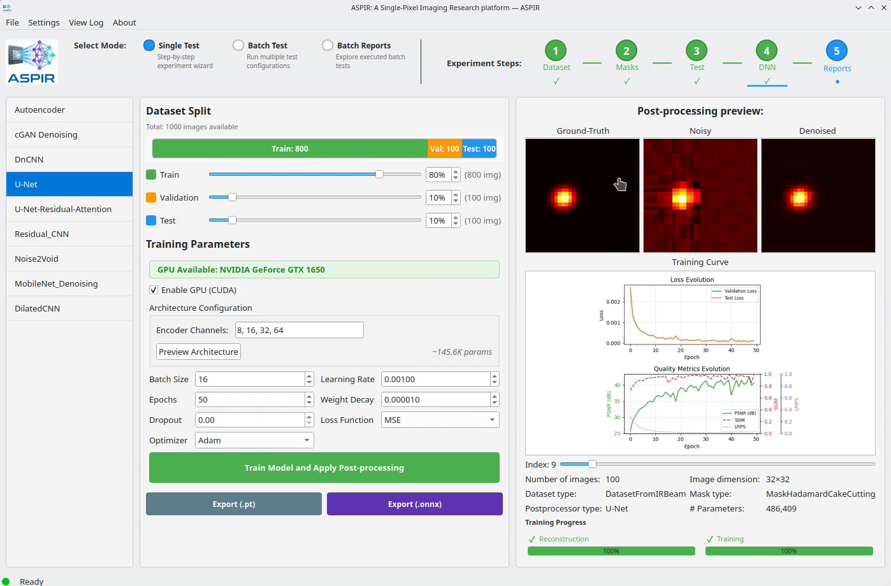

# Step 5: Analyze Results

1. Go to **Reports → Quality Metrics**
2. Click **Analyze Quality**

You'll see metrics comparing:
- Original vs Reconstructed (before NN)
- Original vs Denoised (after NN)

| Metric | Description | Good Value |
|--------|-------------|------------|
| PSNR | Peak Signal-to-Noise Ratio | > 25 dB |
| SSIM | Structural Similarity | > 0.8 |
| LPIPS | Perceptual similarity | < 0.2 |

```{only} html
<video width="80%" controls>
  <source src="../5_reports.mp4" type="video/mp4">
</video>
```

```{only} latex


*Watch the full video in the [online documentation](https://aspir.readthedocs.io/en/latest/quickstart/step5_analysis.html).*
```
